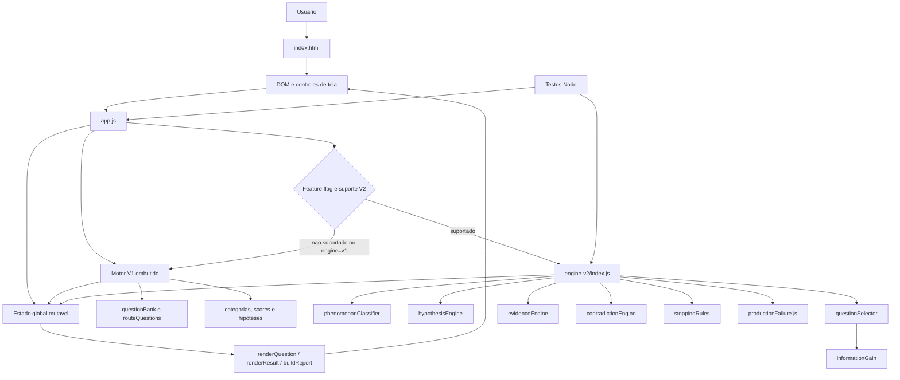
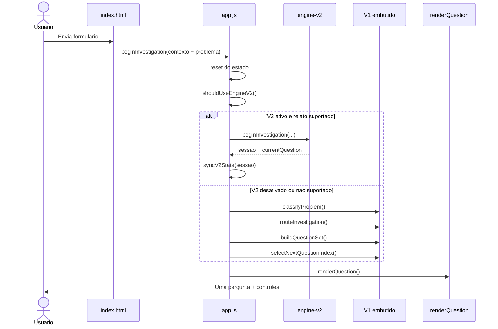

# Fase 2 - Arquitetura atual

## 1. Objetivo e limite

Este documento descreve a arquitetura que existe no repositorio no encerramento da Fase 1. Ele registra o caminho real entre o relato do usuario e a pergunta emitida, sem propor ou implementar o motor substituto.

Escopo observado:

- interface estatica em `index.html` e `styles.css`;
- controlador, estado e motor V1 concentrados em `app.js`;
- motor V2 industrial em `engine-v2/`;
- testes Node em `tests/`;
- nenhuma API, LLM, autenticacao, persistencia ou backend em execucao.

O V1 e o V2 descritos aqui permanecem **baseline legado congelado**. A expressao "V2" neste documento identifica o `engine-v2/` atual, nao a futura arquitetura definida pelo Prompt Mestre.

## 2. Visao de componentes

Evidencias principais:

- `index.html:155-164` carrega os modulos V2 em ordem e, por ultimo, `app.js`.
- `app.js:3-14` resolve `engineV2` e a flag de ativacao; `?engine=v1` forca o legado.
- `app.js:1277-1307` define o estado global compartilhado pela interface e pelo motor V1.
- `app.js:1659-1703,1735-1752` verifica o V2, decide se ele assume e projeta a sessao no estado usado pela UI.
- `engine-v2/index.js:1-37` compoe os modulos V2 por dependencias globais no navegador ou `require` no Node.
- `tests/engine.test.js:3-49,65-69` testa o produto importando diretamente `app.js`, inclusive lendo e alterando seu estado.

## 3. Runtime e implantacao atuais

O produto e uma aplicacao estatica, executada integralmente no navegador:

1. O GitHub Pages entrega HTML, CSS, manifesto e JavaScript.
2. Os scripts usam o padrao UMD: globais no navegador e CommonJS nos testes Node.
3. Toda decisao ocorre em memoria no cliente.
4. Atualizar ou fechar a pagina perde a investigacao.
5. O relatorio e copiado para a area de transferencia ou baixado como arquivo de texto no navegador (`app.js:2777-2794`).

`manifest.webmanifest:1-9` permite exibicao `standalone`, mas nao ha service worker, cache offline ou instalacao nativa. A busca por `fetch`, `localStorage`, `sessionStorage`, `indexedDB`, Supabase ou clientes de API nao encontrou integracao de runtime.

## 4. Fronteiras reais de responsabilidade

| Componente atual | Responsabilidade observada | Fronteira real |
|---|---|---|
| `index.html` | Coleta perfil, segmento, area, publico e problema; hospeda telas de pergunta e resultado | Estrutura visual e controles fixos de resposta |
| `styles.css` | Aparencia responsiva das tres telas | Somente apresentacao |
| `app.js` - controlador de UI | Le formulario, troca telas, renderiza pergunta/historico/resultado, copia e baixa relatorio | Misturado ao estado e ao motor V1 |
| `app.js` - motor V1 | Classifica, roteia, monta banco, pontua, seleciona, registra resposta, conclui e gera plano | Nao existe limite modular dentro do arquivo |
| `app.js` - ponte V2 | Decide V1/V2 e converte sessao V2 para o formato esperado pela UI | Adaptador parcial; continua expondo a mesma UI e o mesmo `state` |
| `engine-v2/index.js` | Coordena classificacao, sessao, pergunta, resposta, parada e diagnostico industrial | Fachada do V2 atual |
| `engine-v2/*.js` | Peso de hipoteses, ganho de informacao, selecao, evidencia textual, contradicoes e parada | Modulos separados, mas acoplados ao schema de `productionFailure.js` |
| `productionFailure.js` | Hipoteses, perguntas, efeitos, subespacos e rotulos industriais | Conhecimento e politica decisoria misturados em JavaScript |
| `tests/*.js` | Regressao de classificacao, elegibilidade, continuidade e V2 industrial | Importam internals; nao simulam a interface nem avaliam os gates do Prompt Mestre |

## 5. Estado atual

### 5.1 Estado V1 e adaptador de UI

`app.js:1277-1307` mantem um unico objeto mutavel com quatro grupos de dados:

| Grupo | Campos principais | Uso atual |
|---|---|---|
| Intake/contexto | `profile`, `problem`, `segment`, `area`, `selectedArea`, `audience` | Entrada e filtro de perguntas |
| Roteamento | `classification`, `route`, `primaryInvestigationPath`, `allowedInvestigationPaths`, `pathLock` | Escolha e bloqueio da linha de investigacao |
| Investigacao | `asked`, `evidence`, `activeHypotheses`, `rejectedHypotheses`, `confirmedFacts`, `hypothesisScores`, `scores`, `questions` | Controle mutavel da conversa e conclusao |
| Diagnostico/debug | `lastAnswerContext`, `investigationPath`, `debugEvents`, `v2Session` | Historico tecnico e ponte do V2 |

Nao ha ids de investigacao, eventos imutaveis, versao de schema, timestamps, fonte/grau de fato, `ProcessModel`, grafo causal, `EvidenceRequest`, `DecisionLogEntry` ou `SolutionSet`.

### 5.2 Sessao V2 atual

`engine-v2/hypothesisEngine.js:49-92` cria outra estrutura mutavel, guardada em `state.v2Session`, com:

- classificacao e fenomeno industrial;
- pesos normalizados de hipoteses preexistentes;
- respostas e ids de perguntas feitas;
- evidencia textual, contradicoes e `debugEvents`;
- subespaco opcional de maquina/ferramental;
- pergunta atual e diagnostico final.

`app.js:1663-1703` copia partes dessa sessao para os campos legados da UI. Portanto, ha duas representacoes simultaneas, sem evento canonico ou projecao reproduzivel.

## 6. Fluxo real: entrada ate a primeira pergunta

### 6.1 Entrada comum

O listener do formulario esta em `app.js:2757-2770`; ele chama `beginInvestigation`, renderiza e troca para a tela de investigacao.

### 6.2 Ramo V2 industrial

1. `app.js:1659-1661` exige flag ativa e fachada V2 disponivel.
2. `app.js:1736-1747` chama `engineV2.beginInvestigation()`.
3. `engine-v2/index.js:77-95` classifica o relato e cria a sessao apenas se o classificador declarar suporte.
4. `phenomenonClassifier.js:18-119` reconhece contexto e fenomeno por regex/keywords.
5. `hypothesisEngine.js:49-87` instancia imediatamente todas as hipoteses e seus pesos.
6. `engine-v2/index.js:61-74` solicita uma pergunta ao seletor.
7. `questionSelector.js:23-28` usa a pergunta de enquadramento quando `needsFraming`; caso contrario, `questionSelector.js:35-68` ordena candidates por ganho de informacao.
8. `app.js:1663-1703` sincroniza a sessao e `app.js:2175-2189` apresenta a pergunta.

Exemplo real coberto pelo teste: "Falhas na producao." gera `production_effect_framing` (`tests/engine-v2-production.test.js:27-40`). Isso ocorre antes de qualquer definicao operacional ou modelo de processo.

### 6.3 Ramo V1/fallback

1. `app.js:1361-1537` transforma o relato em classificacao por regex e scores de confianca.
2. `app.js:1540-1559` seleciona uma rota ou `GENERAL_CAUSAL_INVESTIGATION`.
3. `app.js:1563-1577` infere area adicional por keywords.
4. `app.js:1586-1626` zera e semeia scores por rota/classificacao.
5. `app.js:1630-1652` combina perguntas da rota, perguntas gerais e perguntas de segmento.
6. `app.js:2033-2051` escolhe a primeira pergunta elegivel por prioridade/score.
7. `app.js:2175-2189` escreve texto, contexto e progresso no DOM.
8. `app.js:2201-2208` cria os botoes booleanos ou as opcoes declaradas na pergunta.

Exemplo real coberto pelo teste: "Cliente reclamou de mau atendimento." e roteado para `SERVICE_FAILURE` e recebe `service_manifestation` (`tests/engine.test.js:186-224`).

## 7. Fluxo real: resposta ate a proxima pergunta

### 7.1 V1

1. Clique chama `handleAnswer()` (`app.js:2201-2208`).
2. `recordAnswer()` altera diretamente scores, fatos, evidencias e hipoteses (`app.js:2417-2478`).
3. `shouldFinish()` pode encerrar por quantidade de perguntas e score (`app.js:1867-1873`).
4. Se continuar, `nextQuestionIndex()`/`selectNextQuestionIndex()` escolhe novo item por elegibilidade, rota, continuidade e pesos (`app.js:1912-2051`, `2142-2173`).
5. Um objeto `causal_transition` e gravado em `debugEvents` depois da escolha (`app.js:2484-2508`).
6. `renderQuestion()` apresenta a proxima pergunta.

Consequencia arquitetural: a justificativa e registrada depois de parte da decisao e nao e um `DecisionLogEntry` ligado a evento imutavel.

### 7.2 V2 atual

1. `recordAnswerV2()` chama `engineV2.answer()` (`app.js:2382-2414`).
2. `engine-v2/index.js:110-148` aplica efeitos numericos, registra evidencia textual, contradicoes e muta a sessao.
3. `stoppingRules.js:25-40` decide encerramento por contagem, pesos e evidencia textual.
4. Se continuar, o seletor escolhe outro candidate por ganho de informacao (`engine-v2/index.js:151-188`).
5. Se encerrar, `buildDiagnosis()` transforma a hipotese de maior peso em diagnostico e 5W2H (`engine-v2/index.js:228-264`).
6. A ponte copia o resultado para o estado da UI e a tela e renderizada.

## 8. Fluxo real de conclusao

O V1 usa a categoria de maior score (`app.js:2523-2529`) e monta causa, evidencias, metricas e plano (`app.js:2571-2681`). O V2 usa a hipotese de maior peso (`engine-v2/index.js:228-264`). Ambos alimentam a mesma tela estatica de resultado (`index.html:117-150`).

A tela assume antecipadamente os conceitos "Causa raiz provavel" e "Plano 5W2H" (`index.html:121-139`). Nao existe estado visual para investigacao inconclusiva, pedido de evidencia pendente, contencao separada de acao corretiva ou validacao de eficacia.

## 9. Fronteira de testes

| Suite | O que protege | O que nao prova |
|---|---|---|
| `tests/engine.test.js` | Contrato de perguntas, rotas, continuidade e regressao atendimento/comercial | Processo primeiro, gates G1-G9, event sourcing ou ausencia de alucinacao |
| `tests/service-failure-technical-gap.test.js` | Nao saltar de dificuldade tecnica para promessa sem fatos | Qualidade causal end-to-end |
| `tests/engine-v2-production.test.js` | Enquadramento industrial, mudanca de pesos e diagnostico de equipamento | Definicao operacional, MSA, mecanismo causal ou promocao por evidencia |
| Scripts de debug/auditoria | Inspecao manual de elegibilidade e transicoes | Harness com respondente simulado e golden cases GC1-GC4 |

Os testes importam `app.js` como biblioteca e podem mutar `engine.state` diretamente (`tests/engine.test.js:3`, `65-69`). Eles sao regressao legada, nao contrato do motor reconstruido.

## 10. Comparacao com as cinco camadas alvo

| Camada alvo | O que existe hoje | Lacuna estrutural |
|---|---|---|
| 5 - Interface conversacional | HTML com perguntas preescritas e respostas estruturadas | Nao ha LLM, ECO-CORTE-PERGUNTA, interpretacao estruturada ou modo especialista |
| 4 - Orquestrador metodologico | Seletores por rota/score no V1 e information gain no V2 | Nao ha fases, gates G1-G9, selecao de metodologia por estado ou VOI com custo real |
| 3 - Hipoteses e causalidade | Scores V1; pesos, contradicoes e subespacos V2 | Nao ha grafo causal, estados ordinais, mecanismo, promocao por evidencia ou 5 porques ramificado |
| 2 - Conhecimento | Bancos JavaScript e `productionFailure.js` | Nao ha cards versionados, front-matter, recuperacao ou separacao entre conhecimento e decisao |
| 1 - Estado e eventos | Objetos mutaveis em memoria e `debugEvents` | Nao ha event store, replay, schemas, fontes/graus, supersedencia ou decision log formal |
| Ferramentas deterministicas | Nenhuma | Nao ha Pareto, MSA, CEP, capacidade ou outros calculos sobre dados |

## 11. Acoplamentos que condicionam a reconstrucao

1. `app.js` e simultaneamente controlador, motor, adaptador, relatorio e API de testes.
2. A UI le o formato do estado legado e assume resposta imediata sincrona.
3. O V2 atual depende da ordem dos `<script>` globais no navegador.
4. Perguntas carregam ao mesmo tempo linguagem, precondicoes, score, fatos, hipoteses e evidencia.
5. Conhecimento industrial carrega priors, efeitos e thresholds que controlam a conversa.
6. Testes dependem de funcoes e estado internos, nao de um contrato estavel de eventos/comandos.
7. Nao ha fronteira de persistencia, rede ou identidade do usuario.

Esses acoplamentos explicam por que a migracao precisara de adaptadores e execucao paralela, mas a forma dessa migracao pertence as Fases 4 e 5.

## 12. Evidencia de conclusao da Fase 2

- Diagrama de componentes: Secao 2.
- Fluxo completo input -> pergunta V1/V2: Secao 6.
- Fluxo resposta -> proxima pergunta/conclusao: Secoes 7 e 8.
- Estado, fronteiras, testes e violacoes da arquitetura cognitiva: Secoes 4, 5, 9 e 10.
- Verificacao sem alteracao do baseline: `engine.test.js` (9 casos), `service-failure-technical-gap.test.js` (2 casos) e `engine-v2-production.test.js` (3 casos) executaram com codigo de saida 0.
- Nenhum arquivo do motor foi alterado nesta fase.
