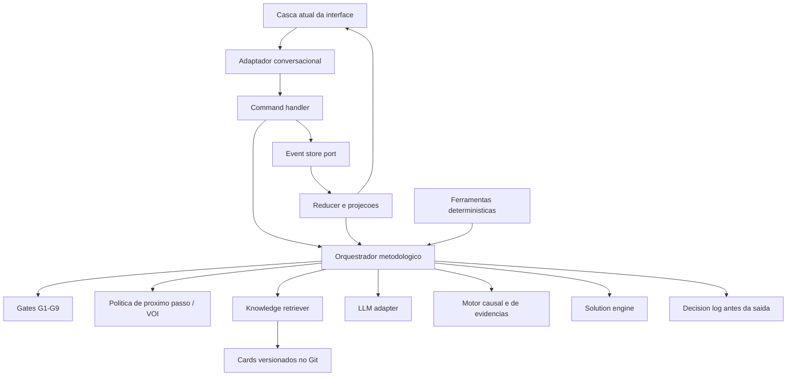
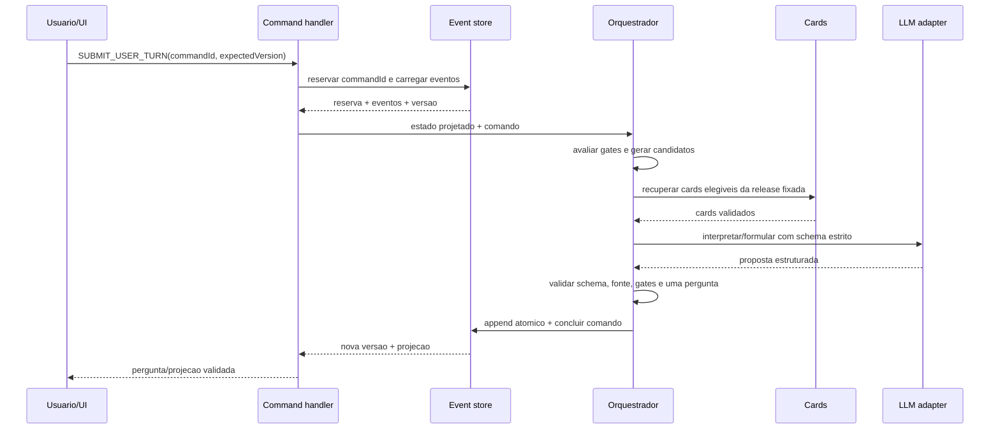
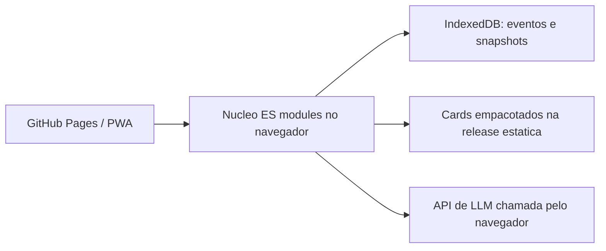
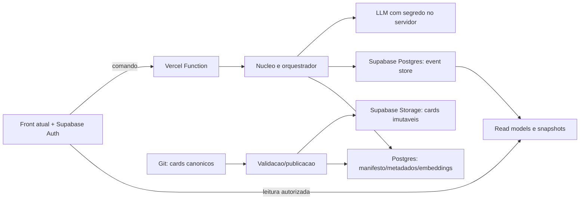

# Fase 4 - Proposta da nova arquitetura

## 1. Status e limite desta fase

Status: **PROPOSTA CONCLUIDA; RUNTIME PENDENTE DE DECISAO**.

Este documento instancia as Secoes 3 a 8 do Prompt Mestre na stack real do
repositorio. Ele define nomes de modulos, contratos, persistencia de eventos,
fronteiras do LLM e duas opcoes de runtime. Nao cria o novo motor, banco,
functions, cards ou harness.

Restricoes preservadas:

- nenhuma linha do motor novo antes de o harness da Fase 6 rodar contra o motor
  atual e produzir o baseline documentado;
- a Fase 5 so comeca depois da decisao explicita entre os runtimes A e B;
- os testes legados permanecem regressao, nao criterio de aceite;
- somente o harness com GC1-GC4 aceitara o motor novo;
- `app.js` e `engine-v2/` continuam intocados como baseline.

## 2. Objetivo de produto

O nucleo nao deve possuir uma arvore para varejo, outra para industria e outra
para servicos. A arquitetura alvo separa:

1. **semantica universal de investigacao**: processo, desvio, fatos, evidencia,
   hipoteses, mecanismo, gates, solucoes e eficacia;
2. **conhecimento do trabalho real**: cards de dominio e metodologia versionados;
3. **linguagem contextual**: vocabulario, exemplos e entidades do segmento;
4. **conversa**: LLM restrito a interpretar e formular, sem autoridade causal.

Assim, "cliente reclama do atendimento" primeiro produz um modelo do processo de
atendimento e do desvio observado. Somente depois os cards compativeis oferecem
familias e discriminadores especificos. O segmento ajuda a falar sobre o processo;
nao escolhe uma causa pronta.

## 3. Arquitetura logica comum



Regra de autoridade: **eventos validos sao a fonte da verdade; o reducer projeta
o estado; o orquestrador decide; o LLM nunca grava nem promove nada**.

## 4. Estrutura proposta na stack atual

O repositorio hoje e JavaScript estatico, sem etapa de build. Para evitar uma
reescrita de framework, o nucleo futuro deve iniciar como ES modules puros e
JSON Schema. Os mesmos modulos poderao rodar no navegador (A) ou em Node.js nas
Vercel Functions (B). A escolha de TypeScript fica fora desta decisao e so sera
justificada se o runtime escolhido trouxer ganho real.

Todos os caminhos abaixo sao **destinos futuros**, nao arquivos criados nesta
fase:

| Caminho proposto | Responsabilidade |
|---|---|
| `src/investigation/contracts/*.schema.json` | Schemas versionados de comandos, eventos, estado, cards e saidas LLM |
| `src/investigation/state/reducer.js` | Reducer puro; replay de eventos para `InvestigationState` |
| `src/investigation/state/invariants.js` | Invariantes que todo estado projetado deve satisfazer |
| `src/investigation/events/eventFactory.js` | Envelope, versao e metadados; sem persistencia concreta |
| `src/investigation/commands/handleCommand.js` | Valida comando, carrega estado, executa um turno e solicita append |
| `src/investigation/orchestrator/nextAction.js` | Politica deterministica de proximo passo |
| `src/investigation/orchestrator/gates.js` | G1-G9 como funcoes puras e testaveis |
| `src/investigation/orchestrator/voi.js` | Compara candidatos por discriminacao, grau esperado e custo |
| `src/investigation/orchestrator/methodSelector.js` | Valida precondicoes e output de methodology cards |
| `src/investigation/causal/graph.js` | Grafo ramificado, relacoes e projecao Ishikawa |
| `src/investigation/causal/promotion.js` | Promocao ordinal exclusivamente por G4 |
| `src/investigation/evidence/ledger.js` | Facts, graus, fontes, contradicoes e supersedencia |
| `src/investigation/evidence/requests.js` | Lacunas e EvidenceRequests, inclusive G5 |
| `src/investigation/knowledge/cardLoader.js` | Le, valida e fixa uma release de cards |
| `src/investigation/knowledge/retriever.js` | Recuperacao estruturada e RAG leve sem poder decisorio |
| `src/investigation/solutions/solutionEngine.js` | G6, robustez, `addressesCause` e eficacia |
| `src/investigation/tools/*.js` | Pareto, capacidade, cartas e outros calculos deterministas |
| `src/investigation/llm/llmPort.js` | Interface neutra de provedor |
| `src/investigation/llm/schemas/*.schema.json` | Outputs estritos de interpretacao, redacao e sintese |
| `src/investigation/llm/semanticValidator.js` | Rejeita output formalmente valido mas causalmente proibido |
| `src/investigation/ports/eventStore.js` | Contrato de append, load, idempotencia e concorrencia |
| `src/investigation/ports/knowledgeRepository.js` | Contrato de release/consulta de cards |
| `src/investigation/ports/telemetry.js` | Metricas tecnicas sem substituir o DecisionLog |
| `src/ui/investigationAdapter.js` | Traduz projecoes/comandos para a casca de `index.html` |
| `knowledge/methods/*.md` | Metodologias declarativas, sem sequencia executavel |
| `knowledge/domains/*.md` | Familias, discriminadores, evidencias e linguagem do trabalho real |

Adaptadores dependentes do runtime so serao fechados depois da decisao:

- A: `src/runtime/browser/indexedDbEventStore.js` e
  `src/runtime/browser/directLlmAdapter.js`;
- B: `api/investigations/turn.js`, `src/runtime/supabase/*` e migrations em
  `supabase/migrations/`.

`engine-v2/` nao sera renomeado nem sobreposto. Ele e arquitetura historica.

## 5. Contratos do nucleo

### 5.1 Command envelope

Todo gesto externo entra como comando. O front nao envia eventos causais.

```json
{
  "schemaVersion": 1,
  "commandId": "uuid",
  "investigationId": "uuid",
  "expectedVersion": 12,
  "type": "SUBMIT_USER_TURN",
  "actorRef": "pseudonymous-id",
  "occurredAt": "ISO-8601",
  "payload": {}
}
```

Comandos minimos:

- `START_INVESTIGATION`;
- `SUBMIT_USER_TURN`;
- `SUBMIT_EVIDENCE`;
- `CORRECT_FACT`;
- `REQUEST_INVESTIGATION_VIEW`;
- `PROPOSE_ACTION`;
- `RECORD_EFFECTIVENESS`;
- `CLOSE_INSUFFICIENT_EVIDENCE`.

Leituras nao alteram o estado. Repetir o mesmo `commandId` devolve o mesmo
resultado persistido e nao repete a transicao.

### 5.2 Event envelope

```json
{
  "eventId": "uuid",
  "investigationId": "uuid",
  "organizationId": "uuid-or-local-workspace",
  "sequence": 13,
  "schemaVersion": 1,
  "type": "FACT_RECORDED",
  "occurredAt": "ISO-8601",
  "actor": { "type": "USER", "ref": "pseudonymous-id" },
  "commandId": "uuid",
  "causationId": "uuid",
  "correlationId": "uuid",
  "knowledgeReleaseId": "release-id",
  "payload": {}
}
```

Eventos minimos por familia:

| Familia | Eventos |
|---|---|
| Ciclo | `INVESTIGATION_STARTED`, `PHASE_CHANGED`, `INVESTIGATION_CLOSED`, `INVESTIGATION_REOPENED` |
| Processo/problema | `PROBLEM_DEFINITION_UPDATED`, `PROCESS_MODEL_UPDATED`, `PROBLEM_TYPE_SET` |
| Conversa | `USER_TURN_SUBMITTED`, `QUESTION_DECIDED`, `QUESTION_EMITTED` |
| Fatos | `FACT_RECORDED`, `FACT_SUPERSEDED`, `FACT_LINKED`, `CONTRADICTION_RECORDED` |
| Evidencia | `EVIDENCE_REQUESTED`, `EVIDENCE_RECEIVED`, `EVIDENCE_MARKED_UNAVAILABLE` |
| Causal | `HYPOTHESIS_RAISED`, `CAUSAL_LINK_ADDED`, `HYPOTHESIS_STATUS_CHANGED` |
| Metodo | `METHOD_SELECTED`, `METHOD_APPLIED`, `METHOD_OUTPUT_RECORDED` |
| Explicabilidade | `DECISION_RECORDED`, `GATE_BLOCKED` |
| Solucao | `ACTION_PROPOSED`, `ACTION_ACCEPTED`, `EFFECTIVENESS_RECORDED` |

`QUESTION_DECIDED`/`DECISION_RECORDED` deve existir antes de
`QUESTION_EMITTED`. Uma correcao cria `FACT_SUPERSEDED`; nunca edita o fato
historico.

### 5.3 Projecao e invariantes

O `InvestigationState` do Prompt Mestre sera uma projecao. Os schemas de
`Fact`, `ProblemDefinition`, `ProcessModel`, `CausalNode`, `EvidenceRequest`,
`DecisionLogEntry`, `SolutionSet` e `Phase` mantem a semantica da Secao 4.

Invariantes adicionais:

1. a sequencia de eventos e estritamente crescente por investigacao;
2. cada evento e valido no schema de sua versao;
3. todo fato tem origem, grau, data e trecho/evento de procedencia;
4. fatos corrigidos continuam no replay e apontam para o sucessor;
5. nenhuma hipotese existe antes de G1;
6. nenhuma promocao ocorre fora do transition set permitido por G4;
7. cada pergunta emitida referencia uma decisao anterior;
8. `Nao sei` nao sustenta nem contradiz hipotese; cria lacuna ou EvidenceRequest;
9. acao corretiva referencia causa provavel ou confirmada;
10. `mode` sempre existe, embora `KAIZEN` nao seja executavel no piloto.

### 5.4 EventStore port

Contrato logico, independente de A ou B:

```text
load(investigationId, fromSequence?) -> Event[]
append(investigationId, expectedVersion, commandId, events[]) -> AppendResult
getCommandResult(commandId) -> CommandResult | null
saveSnapshot(investigationId, version, projectedState) -> void
loadSnapshot(investigationId) -> Snapshot | null
```

`append` deve ser atomico, idempotente e falhar por conflito de versao. Snapshot
e cache sao derivados; nunca substituem eventos.

## 6. Um turno completo



Reservar o comando e uma transacao curta; nenhuma transacao fica aberta durante a
chamada ao LLM. Duplicata encontra `PENDING`/`COMPLETED` e nao inicia outro turno.
O append final grava `USER_TURN_SUBMITTED`, decisao e demais eventos em um lote e
marca o comando `COMPLETED`. Falha do LLM nao altera hipoteses ou fatos; retry usa
o mesmo `commandId`. Conflito de versao descarta a proposta e recalcula sobre o
estado atual.

## 7. Orquestrador metodologico

Ordem obrigatoria em cada turno:

1. projetar o estado a partir dos eventos;
2. avaliar G1-G9;
3. se um gate bloquear, gerar somente acoes que o destravam;
4. senao, recuperar cards elegiveis;
5. gerar candidatos declarativos de pergunta, evidencia ou metodo;
6. eliminar candidatos sem precondicao satisfeita;
7. comparar valor da informacao e custo;
8. registrar a decisao e sua regra;
9. pedir ao LLM apenas a formulacao necessaria;
10. validar e persistir antes de exibir.

A formula de VOI do Prompt Mestre permanece explicavel. `discriminates` e
`expectedEvidenceGrade` vem dos candidates/cards; nao sao probabilidades do LLM.
Empates seguem ordem estavel: gate bloqueado, menor custo, maior preenchimento de
lacuna do estado, identificador estavel. Isso torna replay e testes repetiveis.

O seletor de metodologia nao escolhe por nome do segmento. Ele verifica:

- precondicoes do card;
- `requires_before`;
- lacuna que `produces` preenche;
- custo;
- gates ativos;
- aplicabilidade ao processo e fenomeno ja observados.

## 8. Conhecimento multissegmento sem diagnostico generico

### 8.1 Fonte e release

O Git e a fonte canonica dos cards. Cada investigacao fixa um
`knowledgeReleaseId` com commit e hash. Uma correcao cria nova release; nao muda
retrospectivamente o conhecimento usado em um diagnostico.

### 8.2 Contrato de methodology card

Front matter minimo:

```yaml
id: estratificacao
version: 1
kind: method
purpose: "Localizar onde o fenomeno se concentra"
preconditions: []
requires_before: []
produces: []
cost: BAIXO
candidate_actions: []
exclusions: []
```

O corpo explica aplicacao, dados necessarios, interpretacao e limites. O card
nao contem uma arvore executavel nem altera estado.

### 8.3 Contrato de domain card

```yaml
id: atraso-fila-atendimento
version: 1
kind: domain
phenomena: [espera, atraso, fila, SLA]
process_shapes: [handoff, fila, atendimento]
segments_examples: [varejo, saude, servicos, suporte]
failure_families: []
discriminators: []
evidence_patterns: []
question_candidates: []
anti_patterns: []
language_examples: []
```

Para evitar a resposta repetida "metodo ou rotina pouco padronizada", um domain
card precisa distinguir pelo menos:

- como o fenomeno aparece naquele trabalho;
- etapas e handoffs tipicos;
- familias causais plausiveis, sem transforma-las em causa;
- fatos que sustentariam ou contradiriam cada familia;
- perguntas de alta discriminacao;
- evidencias e testes adequados;
- saltos proibidos e confusoes de dominio;
- vocabulario natural do segmento.

Exemplo: em atendimento, "oferta combina com o publico?" e inelegivel quando o
fenomeno e demora ou postura. Em performance comercial, entrada, conversao,
etapa, canal, oferta e motivos de perda podem ser elegiveis depois que o desvio
comercial estiver definido. A diferenca nasce do estado e das precondicoes, nao
de keyword matching.

### 8.4 Recuperacao

Recuperacao em duas etapas:

1. filtro estruturado por fase, campos preenchidos, processo, fenomeno,
   precondicoes e exclusoes;
2. ranking leve por aderencia do conteudo; embeddings sao opcionais e nunca
   vencem precondicoes ou gates.

O segmento e o tipo de publico refinam linguagem e entidades. Eles nao promovem
hipotese. Cards recuperados geram candidates; o orquestrador conserva a decisao.

## 9. Integracao LLM com validacao

### 9.1 Operacoes permitidas

| Operacao | Entrada limitada | Saida estruturada | Autoridade |
|---|---|---|---|
| `interpretUserTurn` | pergunta, resposta e estado minimo | fatos candidatos com trecho-fonte, lacunas, intencao da resposta | Proposta apenas |
| `draftQuestion` | acao ja escolhida + contexto | `eco`, `corte`, uma `pergunta` | Redacao apenas |
| `suggestHypotheses` | estado pos-G1 + domain cards | hipoteses `origin: ai`, `LEVANTADA`, refs de card | Proposta apenas |
| `summarizeState` | projecao validada | fatos, hipoteses, pendencias por id | Exibicao apenas |
| `explainDecision` | DecisionLogEntry + refs | explicacao em linguagem natural | Exibicao apenas |

### 9.2 InterpretTurnOutput

Cada fato candidato deve conter `statement`, `sourceQuote`, `proposedGrade` e
`targetPath`. O validador confirma que `sourceQuote` existe literalmente no
turno, que o grau e permitido pela origem e que o destino nao cria causalidade.
"Nao sei" aparece em `knowledgeGaps`; nunca em fato causal.

### 9.3 QuestionDraftOutput

Deve conter exatamente uma pergunta, salvo autorizacao explicita do candidato
para duas perguntas trivialmente conjuntas. O texto:

- segue ECO -> CORTE -> PERGUNTA;
- nao oferece `Sim/Nao` para pergunta disjuntiva;
- nao cita Ishikawa, 5 Porques, TPS ou o nome do card ao usuario, a menos que ele
  pergunte pela justificativa/metodo;
- nao introduz fato, causa ou percentual de confianca;
- respeita o vocabulario e as entidades presentes no estado/card.

### 9.4 Dupla validacao

1. **Estrutural**: Structured Outputs/JSON Schema estrito, schema versionado,
   campos obrigatorios e `additionalProperties: false`.
2. **Semantica deterministica**: fontes, fases, gates, cardinalidade da pergunta,
   transicoes permitidas, release dos cards e termos proibidos naquele contexto.

JSON Schema garante forma, nao verdade. Output invalido pode ser reparado uma
vez dentro de limite configurado; persistindo a falha, o turno retorna erro
recuperavel sem mutar estado causal.

Modelo, provedor, promptVersion, schemaVersion, latencia e consumo entram na
telemetria. Nao se registra raciocinio privado do modelo. A escolha de modelo
sera configuravel e validada pelo harness, nao fixada nesta arquitetura.

## 10. Motor causal, evidencias e solucoes

O Ishikawa e uma projecao do grafo, nao uma taxonomia que controla a conversa.
Categorias podem se expandir para gestao, informacao, software ou fornecedor.
Os Cinco Porques geram ramos e podem parar em lacuna, evidencia indisponivel ou
causa sistemica acionavel; profundidade cinco nao e meta.

G4 e a unica autoridade de promocao. Um relato causal do usuario entra com
origem e grau compativeis e pode gerar EvidenceRequest. O LLM nao altera status.

O Solution Engine so aceita correcao/corretiva/preventiva apos G6. Contencao
pode ocorrer antes quando houver risco. Toda corretiva aponta para
`addressesCause`; niveis fracos de robustez exigem justificativa; fechamento
exige plano e veredicto de eficacia. `INEFICAZ` reabre por evento.

## 11. Modo Kaizen preparado

`mode` faz parte do estado e dos eventos desde o inicio. Contratos de processo,
fatos, experimentos, eficacia, PDCA e SDCA nao assumem necessariamente defeito.
O piloto aceita apenas `ROOT_CAUSE`; comando `START_INVESTIGATION` com `KAIZEN`
retorna modo ainda nao suportado, sem criar fluxo parcial.

## 12. Opcao A - app estatico, LLM direto e persistencia local



Implementacao conceitual:

- eventos, snapshots e `commandId` em IndexedDB;
- cards publicados junto da aplicacao e cacheados por service worker;
- gates/reducer/orquestrador no navegador;
- chamada direta do navegador ao provedor de LLM;
- exportacao/importacao manual da investigacao como arquivo assinado por hash,
  sem torna-lo prova externa de integridade.

Vantagens:

- menor infraestrutura e custo fixo;
- prototipo rapido;
- parte deterministica e historico disponiveis offline;
- adequada para harness, demonstracao e dados sinteticos.

Limites criticos:

- uma chave do produto no browser ou app movel pode ser extraida e usada fora
  do sistema; um proxy corrigiria isso, mas deixaria de ser a opcao A pura;
- historico pode ser alterado, perdido ou limpo no dispositivo;
- nao ha continuidade confiavel entre celular e computador;
- nao ha colaboracao, isolamento multiempresa ou trilha central;
- limites de uso e custo aplicados no JavaScript sao contornaveis;
- offline e parcial porque o LLM continua remoto;
- cards exigem novo deploy e nao possuem governanca central de release ativa.

Parecer: **viavel somente para demo/harness/piloto controlado; reprovada como
runtime puro de um SaaS B2B comercial**.

## 13. Opcao B - Supabase + Vercel Functions + front como casca



Regra operacional: **Supabase guarda a verdade; Vercel autoriza e coordena;
LLM interpreta e redige; front exibe e coleta comandos**.

### 13.1 Modelo de dados conceitual

| Tabela/read model | Finalidade |
|---|---|
| `organizations`, `organization_members` | Isolamento multiempresa e papeis |
| `investigations`, `investigation_heads` | Metadados, versao atual, modo e release fixada |
| `investigation_events` | Append-only por `organization_id`, investigacao e sequencia |
| `commands` | Idempotencia, estado do turno e resultado serializado |
| `investigation_snapshots` | Acelerar replay; sempre reconstruivel |
| `facts`, `evidence_requests`, `causal_nodes`, `decision_log`, `actions` | Projecoes de leitura reconstruiveis |
| `knowledge_releases`, `knowledge_cards`, `knowledge_sections` | Manifesto, hash, metadados e busca/RAG |
| `outbox` | Trabalho assincrono: embeddings, relatorios e metricas |

Restricoes essenciais:

- unique `(investigation_id, sequence)`;
- unique `(organization_id, investigation_id, command_id)`;
- reserva curta do comando antes do LLM, com estados `PENDING`, `COMPLETED` e
  `RETRYABLE_FAILED`;
- append atomico com `expectedVersion`;
- usuarios nao possuem `UPDATE`/`DELETE` no event store;
- nenhuma transacao permanece aberta durante a chamada ao LLM;
- se a versao mudar, a saida do LLM nao e persistida e o turno e recalculado;
- snapshots e projecoes guardam `sourceVersion`.

### 13.2 Seguranca

- `organization_id` em toda entidade empresarial;
- RLS e grants minimos nas tabelas expostas;
- escrita de eventos apenas pela Function apos autorizacao explicita;
- `service_role` e chave de LLM somente no ambiente server-side;
- ao usar `service_role`, a Function repete a autorizacao porque a chave ignora
  RLS;
- views de leitura nao podem contornar RLS;
- buckets privados e politicas em `storage.objects`;
- texto do usuario e input nao confiavel e nao pode alterar prompt, card ou gate;
- rate limit, quota e orcamento por organizacao no servidor.

Grants e RLS sao controles diferentes e devem nascer na mesma migration. Cards
no Storage sao artefatos; operacoes usam a Storage API, nao mutacao direta de
suas tabelas internas.

### 13.3 Publicacao dos cards

1. pull request revisa o Markdown canonico;
2. CI valida YAML, schema, ids, refs, duplicidade e examples;
3. release imutavel recebe commit SHA e hash;
4. Markdown exato vai ao Storage;
5. metadados e embeddings opcionais vao ao Postgres;
6. investigacao fixa o `knowledgeReleaseId`;
7. rollback troca a release ativa apenas para novas investigacoes;
8. drift check compara Git, manifesto e objeto publicado.

Backups do banco nao devem ser assumidos como backup dos objetos do Storage.
Git permite reconstruir cards; anexos/evidencias precisam politica propria.

### 13.4 Observabilidade e LGPD por desenho

Cada turno carrega `traceId`, `commandId`, investigacao, versao, release de cards,
modelo, promptVersion, schemaVersion, latencia e consumo. Metricas minimas:
latencia, erro LLM, conflito, duplicidade, bloqueios por gate, atraso de projecao,
custo por investigacao e perguntas fora de contexto.

DecisionLog e dado de negocio; log de plataforma nao o substitui. Logs tecnicos
nao recebem texto integral, prompt ou dado pessoal quando ids/hashes bastarem.

Para LGPD, a arquitetura deve oferecer minimizacao, finalidade, isolamento,
retencao configuravel, exportacao e exclusao/anonimizacao. Identidade direta
fica separada do evento; eventos usam referencia pseudonima. Isso permite apagar
ou inutilizar identidade sem reescrever a sequencia causal. Papeis de
controlador/operador, transferencia internacional, DPA e retencao do provedor de
LLM exigem validacao juridica e contratual antes de venda.

Parecer: **recomendada para o produto comercial**, com maior custo e disciplina
operacional em troca de seguranca, multiempresa, auditoria, colaboracao,
governanca dos cards e controle do consumo.

## 14. Comparativo e decisao pendente

| Criterio | A - navegador/local | B - Supabase/Vercel |
|---|---|---|
| Segredo do LLM | Inseguro para chave do produto | Protegido no servidor |
| Event sourcing | Local, alteravel/perdivel | Central, concorrente e auditavel |
| Multiempresa | Nao | Sim, com Auth/RLS/autorizacao |
| Multidispositivo/equipe | Nao confiavel | Sim |
| Cards por release | Bundle estatico | Git canonico + release imutavel publicada |
| Controle de custo | Contornavel no cliente | Quota/rate limit no servidor |
| Offline | Parcial | Interface pode degradar; motor requer rede |
| Complexidade inicial | Baixa | Media/alta |
| Custo fixo | Baixo | Supabase + Vercel + operacao |
| LGPD/auditoria empresarial | Fraca | Viavel com controles e contratos |
| Adequacao para venda B2B | Nao recomendada | Recomendada |

**Recomendacao tecnica: opcao B.** A decisao permanece com o usuario e esta
registrada como pendente em `adrs/ADR-001-runtime-pendente.md`.

## 15. ADRs e fontes tecnicas

ADRs desta fase:

- `adrs/ADR-001-runtime-pendente.md`;
- `adrs/ADR-002-eventos-como-autoridade.md`;
- `adrs/ADR-003-llm-como-adaptador.md`;
- `adrs/ADR-004-conhecimento-multissegmento.md`.

Fontes oficiais consultadas para riscos de plataforma:

- OpenAI, seguranca de API keys:
  https://help.openai.com/en/articles/5112595-best-practices-for-api-key-safety
- OpenAI, Structured Outputs:
  https://developers.openai.com/api/docs/guides/structured-outputs
- Supabase, RLS:
  https://supabase.com/docs/guides/database/postgres/row-level-security
- Supabase, seguranca da Data API:
  https://supabase.com/docs/guides/api/securing-your-api
- Supabase, Storage access control:
  https://supabase.com/docs/guides/storage/security/access-control
- Supabase, Storage schema:
  https://supabase.com/docs/guides/storage/schema/design
- Supabase, backups:
  https://supabase.com/docs/guides/platform/backups
- Vercel Functions:
  https://vercel.com/docs/functions
- Vercel environment variables:
  https://vercel.com/docs/environment-variables
- Vercel Functions limits:
  https://vercel.com/docs/functions/limitations

## 16. Gate para a proxima fase

Esta Fase 4 termina sem iniciar a Fase 5. O unico input necessario agora e uma
decisao explicita:

- **A** - manter runtime local/estatico, aceitando que ele nao e adequado como
  SaaS B2B comercial puro; ou
- **B** - adotar Supabase como event store/registry de cards e Vercel Functions
  como fronteira de orquestracao e LLM.

Depois dessa decisao, a Fase 5 podera detalhar a migracao sem quebrar o produto.
Ainda assim, o primeiro artefato executavel novo continuara sendo o harness da
Fase 6 contra o motor atual.
